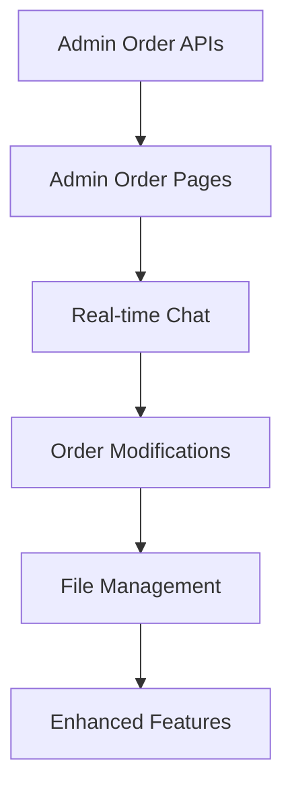

# Financial Transfer Management System - Next Development Steps

## 🎯 **Development Priority Plan**

### **Phase 1: Admin Order Management (CRITICAL - Implement First)**

#### **1.1 Admin Order Management APIs**
```typescript
// Required API endpoints to implement:

src/app/api/admin/orders/
├── route.ts                     # GET: List all orders with filtering
├── [orderId]/
│   ├── route.ts                 # GET: Order details for admin
│   ├── approve/route.ts         # POST: Approve order  
│   ├── reject/route.ts          # POST: Reject with reason
│   ├── complete/route.ts        # POST: Mark as completed
│   ├── upload/route.ts          # POST: Upload completion screenshots
│   └── cancel/route.ts          # POST: Handle cancellation requests
```

**Key Features Needed:**
- ✅ Order status workflow validation
- ✅ Balance updates on status changes  
- ✅ Commission calculations
- ✅ File handling for completion proofs
- ✅ Real-time notifications
- ✅ Cancellation request management

#### **1.2 Admin Order Detail Pages**
```typescript
src/app/admin/orders/
├── [orderId]/
│   ├── page.tsx                 # Order detail view & actions
│   ├── chat/page.tsx           # Admin-exchange messaging
│   └── edit/page.tsx           # Order modification (if needed)
```

**Required Features:**
- Order status management interface
- File upload for completion screenshots  
- Amount confirmation for incoming transfers
- Rejection reason input
- Real-time status updates
- Order timeline display

### **Phase 2: Real-time Communication**

#### **2.1 Order Messaging System**
```typescript
src/app/api/
├── messages/
│   ├── route.ts                 # POST: Send message
│   └── [messageId]/route.ts     # GET/DELETE: Message management
└── orders/
    └── [orderId]/
        └── messages/
            └── route.ts         # GET: Order chat history
```

#### **2.2 Real-time Hooks & Components**
```typescript
src/hooks/
├── useRealtimeOrders.ts         # Live order updates
├── useRealtimeChat.ts           # Live messaging  
├── useRealtimeBalance.ts        # Live balance updates
└── useOrderActions.ts           # Order management actions

src/components/
├── OrderChat.tsx                # Chat interface component
├── OrderStatusTimeline.tsx      # Status progression
└── OrderActions.tsx             # Admin action buttons
```

### **Phase 3: Order Modifications & File Management**

#### **3.1 Order Edit & Cancel System**
```typescript
src/app/api/exchange/orders/
└── [orderId]/
    ├── edit/route.ts            # PUT: Edit pending orders
    ├── cancel/route.ts          # POST: Cancel/request cancellation
    └── upload/route.ts          # POST: Re-upload payment proofs
```

#### **3.2 File Management System**  
```typescript
src/app/api/
├── upload/
│   ├── route.ts                 # POST: Generic file upload
│   ├── payment-proof/route.ts   # POST: Payment proof upload
│   └── completion-proof/route.ts # POST: Completion proof upload
└── download/
    └── [fileId]/route.ts        # GET: Secure file download
```

### **Phase 4: Enhanced Features**

#### **4.1 Advanced Admin Features**
- Bulk order operations (approve/reject multiple)
- Order analytics and reporting
- Export functionality  
- Advanced filtering and search

#### **4.2 Mobile Enhancements**
- PWA capabilities
- Native mobile sharing
- Camera integration improvements
- Offline functionality

#### **4.3 Real-time Notifications**
- Push notifications
- Email notifications  
- SMS notifications (optional)

---

## 🔥 **Immediate Action Items (Start Here)**

### **1. Admin Order Management API** 
**Priority: CRITICAL**
- Implement admin orders listing API
- Create order approval/rejection endpoints
- Add completion and upload functionality
- Handle cancellation requests

### **2. Admin Order Detail Pages**
**Priority: CRITICAL**  
- Build admin order detail interface
- Add action buttons (approve/reject/complete)
- Implement file upload for completion proofs
- Create order status management

### **3. Real-time Messaging**
**Priority: HIGH**
- Implement order-specific chat API
- Create real-time message components
- Add Supabase real-time subscriptions

### **4. Order Modifications**
**Priority: HIGH**
- Add order edit functionality for exchanges
- Implement cancellation system
- Handle balance recalculations

---

## 📊 **Implementation Sequence**



### **Week 1: Admin Order Management**
1. Create admin order management APIs
2. Build admin order detail pages
3. Implement order status workflow
4. Add file upload for completion proofs

### **Week 2: Real-time Features**  
1. Implement order messaging system
2. Add real-time subscriptions
3. Create chat interfaces
4. Build notification system

### **Week 3: Order Modifications**
1. Add order edit functionality
2. Implement cancellation system
3. Create file re-upload features
4. Handle balance recalculations

### **Week 4: Polish & Testing**
1. Add enhanced admin features
2. Improve mobile experience
3. Performance optimization
4. Comprehensive testing

---

## 🛠️ **Technical Considerations**

### **Database Requirements**
- ✅ All tables already created and seeded
- ✅ Order status transitions validated
- ✅ File storage configured with Supabase

### **Real-time Setup**
- ✅ Supabase real-time subscriptions ready
- ✅ Timezone utilities implemented
- ✅ Mobile-first design in place

### **Security & Validation**
- ✅ Authentication system working
- ✅ Role-based access control implemented
- ✅ Input validation utilities ready

---

**Current Status**: Foundation is solid, core order management APIs and admin interfaces are the critical missing pieces to make the system fully functional.

**Recommendation**: Start with Phase 1 (Admin Order Management) immediately as this is blocking the core workflow of the application. 