# Simplified Mobile Web App Tech Stack (Internal Use)

> **Lightweight, high-performance stack for internal mobile web applications with real-time capabilities**

## 📋 Quick Overview

**Purpose**: Internal mobile web app with real-time updates, optimized performance, and mobile-first UI

**Key Requirements**:
- ⚡ Ultra-fast mobile performance
- 📱 Mobile-first responsive design  
- 🔄 Real-time data updates
- 🛡️ Simple internal authentication
- 📊 Live data management

---

## 🚀 Core Technologies

### Frontend Stack
- **Next.js 15+** - React framework with SSR and mobile optimization
- **React 19** - Latest React with Server Components
- **TypeScript** - Type safety and better development experience
- **Tailwind CSS** - Mobile-first utility framework
- **Shadcn/ui** - Pre-built mobile-optimized components

### Backend Stack
- **Node.js 22 LTS** - Runtime environment
- **Supabase** - PostgreSQL database with real-time subscriptions + Storage
- **Supabase Storage** - Secure file storage for screenshots
- **Supabase Auth** - Session-based authentication
- **Prisma** - Type-safe database ORM
- **Redis** - Caching and session storage

---

## 📱 Mobile-First Features

### Performance Optimization
```javascript
// Key mobile performance features
- Code splitting and lazy loading
- Image optimization (WebP, responsive)
- Virtual scrolling for large lists
- Aggressive caching strategies
- Sub-100ms touch interactions
- Offline-first data handling
```

### Real-Time Updates
```javascript
// Financial transfer real-time subscriptions (Jordanian timezone)
import { utcToZonedTime, format } from 'date-fns-tz'

const JORDAN_TIMEZONE = 'Asia/Amman'

const { data: orders } = await supabase
  .from('orders')
  .select('*')
  .on('UPDATE', payload => {
    // Live order status changes with Jordanian time
    const jordanTime = format(utcToZonedTime(new Date(), JORDAN_TIMEZONE), 'HH:mm')
    toast.success(`Order ${payload.new.id} status: ${payload.new.status} (${jordanTime})`)
  })
  .subscribe()

const { data: balances } = await supabase
  .from('exchanges')
  .select('balance')
  .on('UPDATE', payload => {
    // Real-time balance updates
    updateBalance(payload.new.balance)
  })
  .subscribe()

const { data: messages } = await supabase
  .from('order_messages')
  .select('*')
  .on('INSERT', payload => {
    // Live chat messages with Jordanian timestamp
    const messageWithJordanTime = {
      ...payload.new,
      displayTime: format(utcToZonedTime(payload.new.created_at, JORDAN_TIMEZONE), 'h:mm a')
    }
    addMessageToChat(messageWithJordanTime)
  })
  .subscribe()
```

### Mobile UI Components
- Touch-optimized interfaces (44px minimum touch targets)
- Gesture support (swipe, pinch) with react-swipeable
- Mobile navigation patterns with pull-to-refresh
- Progressive Web App (PWA) capabilities
- Native-like animations with Framer Motion
- Mobile camera integration for screenshot capture
- WhatsApp sharing functionality
- Mobile-first form inputs and validation

---

## 🔐 Simple Authentication

### Internal User Management
```javascript
// Session-based auth for internal users
- Manual user creation by admin
- JWT tokens for API calls
- Simple login/logout flow
- Role-based access control
```

---

## ⚡ Performance Stack

### State Management
- **Zustand** - Lightweight state management
- **TanStack Query** - Server state and caching
- **Supabase React hooks** - Real-time data binding

### Monitoring
- **Vercel Analytics** - Performance metrics
- **Sentry** - Error tracking
- **Web Vitals** - Core performance monitoring

---

## 📦 Essential Dependencies

### Core Package.json
```json
{
  "dependencies": {
    "next": "^15.0.0",
    "react": "^19.0.0",
    "typescript": "^5.3.0",
    "tailwindcss": "^3.4.0",
    "@supabase/supabase-js": "^2.39.0",
    "prisma": "^5.8.0",
    "zustand": "^4.4.0",
    "@tanstack/react-query": "^5.15.0",
    "framer-motion": "^11.0.0",
    "react-hook-form": "^7.48.0",
    "zod": "^3.22.0"
  }
}
```

### Financial & File Management
```json
{
  "dependencies": {
    "decimal.js": "^10.4.3",
    "react-dropzone": "^14.2.3",
    "react-image-crop": "^11.0.5",
    "file-saver": "^2.0.5",
    "react-camera-pro": "^1.4.0",
    "image-compression": "^2.0.2",
    "date-fns": "^3.2.0",
    "date-fns-tz": "^2.0.0"
  }
}
```

### Mobile & Sharing
```json
{
  "dependencies": {
    "react-share": "^5.0.3",
    "react-device-detect": "^2.2.3",
    "react-use": "^17.4.0",
    "react-mobile-picker": "^2.6.1",
    "react-swipeable": "^7.0.1"
  }
}
```

### Real-time & Notifications
```json
{
  "dependencies": {
    "react-hot-toast": "^2.4.1",
    "react-use-websocket": "^4.8.1",
    "react-intersection-observer": "^9.5.0"
  }
}
```

### Security & Performance
```json
{
  "dependencies": {
    "bcryptjs": "^2.4.3",
    "jsonwebtoken": "^9.0.2",
    "@tanstack/react-virtual": "^3.0.0",
    "@sentry/nextjs": "^7.99.0",
    "validator": "^13.11.0"
  }
}
```

---

## 🏦 Financial System Features

### **File Upload & Management**
```javascript
// File upload with validation
- react-dropzone for drag-and-drop uploads
- image-compression for optimizing screenshots
- file-saver for download functionality
- Supabase Storage for secure file hosting
- File format validation (PNG, JPG, JPEG)
- 5MB file size limits with compression
```

### **Financial Calculations**
```javascript
// Precision financial arithmetic
- decimal.js for accurate JOD calculations
- Commission calculations (fixed + percentage)
- Balance management with precision
- Real-time calculation display
- Support for negative balances
```

### **Order ID Generation**
```javascript
// Custom order ID pattern: TYYMMXXXX (Jordanian timezone)
import { format } from 'date-fns'
import { zonedTimeToUtc, utcToZonedTime } from 'date-fns-tz'

const JORDAN_TIMEZONE = 'Asia/Amman'

const generateOrderId = async (orderDate = new Date()) => {
  // Convert to Jordanian local time
  const jordanTime = utcToZonedTime(orderDate, JORDAN_TIMEZONE)
  
  const year = format(jordanTime, 'yy')     // 25 for 2025
  const month = format(jordanTime, 'MM')    // 06 for June
  
  // Get next sequential number for the month
  const sequentialNumber = await getNextSequentialNumber(year, month)
  const paddedNumber = sequentialNumber.toString().padStart(4, '0')
  
  return `T${year}${month}${paddedNumber}` // T25060001
}

// Timezone utility functions
const getJordanTime = () => utcToZonedTime(new Date(), JORDAN_TIMEZONE)
const formatJordanTime = (date, formatString) => 
  format(utcToZonedTime(date, JORDAN_TIMEZONE), formatString)

// Examples:
// T25060001 - First order in June 2025 (Jordanian time)
// T25060002 - Second order in June 2025 (Jordanian time)
// T25070001 - First order in July 2025 (resets monthly)
```

### **Mobile Camera & Sharing**
```javascript
// Mobile-specific features
- react-camera-pro for screenshot capture
- Native mobile camera access
- react-share for WhatsApp integration
- file-saver for download functionality
- Mobile sharing API integration
```

### **Jordanian Mobile Validation**
```javascript
// Custom validation patterns
const jordanianMobileRegex = [
  /^00962(77|78|79)\d{7}$/,  // International: 0096277/78/79XXXXXXX
  /^0(77|78|79)\d{7}$/       // Local: 07/78/79XXXXXXX
]

// Using validator.js + zod for validation
import validator from 'validator'
import { z } from 'zod'
```

### **Real-time Chat & Notifications**
```javascript
// Order-specific communication
- Supabase real-time subscriptions
- react-hot-toast for notifications
- Instant message delivery
- Chat history preservation
- Mobile notification support
```

### **Jordanian Timezone Management**
```javascript
// Timezone handling for all app features
import { utcToZonedTime, zonedTimeToUtc } from 'date-fns-tz'
import { format } from 'date-fns'

const JORDAN_TIMEZONE = 'Asia/Amman' // EEST: UTC+3

// Core timezone utilities
const toJordanTime = (date) => utcToZonedTime(date, JORDAN_TIMEZONE)
const fromJordanTime = (date) => zonedTimeToUtc(date, JORDAN_TIMEZONE)

// Chat timestamp formatting
const formatChatTime = (timestamp) => 
  format(toJordanTime(timestamp), 'HH:mm') // 24-hour for admin

const formatMobileChatTime = (timestamp) => 
  format(toJordanTime(timestamp), 'h:mm a') // 12-hour for mobile

// Order date formatting
const formatOrderDate = (timestamp) =>
  format(toJordanTime(timestamp), 'dd/MM/yyyy HH:mm')
```

---

## 🏗️ Simple Deployment

### Infrastructure (Vercel + Supabase)

```mermaid
graph TD
    A[📱 Mobile Web App] --> B[🌐 Vercel Edge CDN]
    B --> C[⚛️ Next.js App]
    C <--> D[🗄️ Supabase DB + Realtime]
    C --> E[🗄️ Redis Cache]
    
    D --> F[📡 Live Data Sync]
    D --> G[🔄 Real-time Subscriptions]
```


### Deployment Steps
1. **Vercel** - Frontend hosting with edge optimization
2. **Supabase** - Database with real-time subscriptions  
3. **Redis** - Caching layer for performance
4. **Domain + SSL** - Production deployment

---

## 🎯 Development Workflow

### Mobile-First Development
```bash
# Development commands
npm run dev          # Local development
npm run build        # Production build
npm run test         # Testing
npm run lint         # Code quality
```

### Key Development Practices
- Mobile-first responsive design
- Real-time data binding with Supabase
- Performance monitoring from day one
- Simple authentication flow
- Touch-optimized user interfaces

---

## 🔧 Mobile Optimization Rules

### Performance Guidelines
1. **Images**: Use WebP format with responsive sizing + image compression
2. **Loading**: Implement lazy loading for all content + virtual scrolling
3. **Caching**: Multi-layer caching (browser, CDN, database) + Redis
4. **Code Splitting**: Route-based and component-based splitting
5. **Touch**: Ensure 44px minimum touch targets for all buttons
6. **Animations**: Hardware-accelerated CSS transforms with Framer Motion
7. **File Uploads**: Compress images before upload (< 5MB limit)
8. **Camera Access**: Progressive enhancement for mobile camera features

### Financial System Best Practices
1. **Calculations**: Use decimal.js for all JOD amount calculations
2. **Order IDs**: Generate unique IDs with TYYMMXXXX pattern (T25060001)
3. **Timezone**: Always use Jordanian local time (Asia/Amman) for all timestamps
4. **Validation**: Implement Jordanian mobile number validation
5. **File Security**: Validate file types and scan for security
6. **Commission Display**: Show real-time commission calculations
7. **Balance Updates**: Instant balance recalculation with order changes
8. **WhatsApp Integration**: Native mobile sharing for screenshots

### Real-Time Best Practices
1. **Subscriptions**: Use Supabase real-time for live data
2. **Optimistic Updates**: Update UI before server confirmation
3. **Error Handling**: Graceful fallbacks for offline states
4. **Batching**: Group multiple updates to reduce re-renders
5. **Chat Messages**: Instant delivery with read receipts
6. **Notifications**: Toast notifications for all status changes

---

**Stack Summary**: Next.js + Supabase + Vercel + Financial Libraries = Fast, real-time, mobile-optimized financial transfer management system with WhatsApp integration, file management, and precision calculations optimized for Jordanian market requirements.